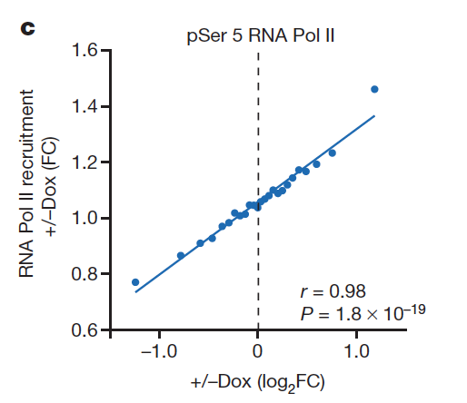

欢迎关注“小丫画图”公众号，同名知识星球等你加入

小丫微信: epigenomics  E-mail: figureya@126.com

作者：贝塔猫

小丫编辑校验

```{r setup, include=FALSE}
knitr::opts_chunk$set(echo = TRUE)
```

## 需求描述

输入TCGA的表达矩阵，按文章中的方法计算bin(或者不取bin)、批量计算一个基因跟多个基因的相关系数、pvalue，画出文章里的图

 

出自<https://www.nature.com/articles/nature13473>

## 应用场景

批量筛选哪些基因跟你感兴趣的基因呈正/负相关。

不仅适用于基因表达的相关性分析，还适用于像例文那样的转录因子结合（ChIP）跟靶基因变化倍数（RNA-seq）的相关性分析。把示例中的基因信息替换成位点信息即可。

在画ChIP-seq、ATAC-seq或DNA甲基化等动辄成千上万个位点时，可以尝试这种取bin的方式画图。

## 环境设置

```{r}
#使用国内镜像安装包
#options("repos"= c(CRAN="https://mirrors.tuna.tsinghua.edu.cn/CRAN/"))
#options(BioC_mirror="http://mirrors.ustc.edu.cn/bioc/")
library(reshape2)
library(cowplot)
library(plyr)
Sys.setenv(LANGUAGE = "en") #显示英文报错信息
options(stringsAsFactors = FALSE) #禁止chr转成factor
```

## 参数设置

```{r}
symbol <- "HDAC1"
topnumber = 6 #取正相关排名Top 6和负相关排名Top 6的基因

# plot with special pointnumber by groupping gene expression levels into equally sized bins
pointnumber = 20 
# plot without bins
#pointnumber = NULL
```

## 输入文件

easy_input.csv，基因表达矩阵，第一列是gene symbol，后面是表达矩阵。

示例数据取自FigureYa71ssGSEA的not_easy_input_expr.txt文件，把表达矩阵的第一列gene_id换成gene symbol，可参考FigureYa71ssGSEA或FigureYa56immune_inflitration的处理方式。为方便传输，取了表达量最高的1000个基因。

```{r}
tcga_expr <- read.csv("easy_input.csv", row.names = 1)
tcga_expr[1:3,1:3]
```

## 计算相关系数

此处采用两种方法计算相关系数：pearson和spearman

```{r, warning=FALSE}
# 目标基因
target.exps <- tcga_expr[symbol,]
# 其余基因
other.expr <- tcga_expr[-which(rownames(tcga_expr)==symbol),]

# pearson
sgcor <- as.data.frame(cor(t(other.expr), t(target.exps))) #默认pearson
colnames(sgcor) <- "r_pearson"
# 计算pvalue，运行时间较长
sgcor$pval_pearson <- apply(other.expr, 1, function(x) (cor.test(x, t(target.exps))$p.value))

# spearman
sgcor_spearman <- as.data.frame(cor(t(other.expr), t(target.exps), method = "spearman"))
colnames(sgcor_spearman) <- "r_spearman"
sgcor_spearman$pval_spearman <- apply(other.expr, 1, function(x)(cor.test(x, t(target.exps), method = "spearman")$p.value))

# 把相关系数、pvalue都写进cors里
cors <- cbind(sgcor, sgcor_spearman)
cors$gene <- rownames(other.expr)
head(cors)

# 取相关系数排名前几位的基因，在参数设置里修改topnumber
# 此处取前6和后6，也就是正相关Top6和负相关Top6
newcor <- cors[!(is.na(cors$r_pearson)),]
dim(newcor)
sortcor <- newcor[order(newcor$r_pearson, newcor$r_spearman, decreasing = T),]
topcor <- sortcor[c(1:topnumber, #正相关Top 6
                    (nrow(sortcor) - topnumber + 1):nrow(sortcor)),] #负相关Top 6
rownames(topcor)

# 提取相关系数排名前几位基因的表达矩阵
genes <- c(symbol,rownames(topcor))
genesexps <- as.data.frame(t(tcga_expr[genes,]))
sortgenesexps <- genesexps[order(genesexps[,1]),]
samplenum <- nrow(sortgenesexps)
```

例文中输入数据是ChIP-seq的peak，直接画甚至会有上万个点，因此，作者取了bin。

你也可以不取bin，而是画出所有的点，在参数设置里pointnumber设为NULL

```{r}
if(is.null(pointnumber)){
  pointnumber=samplenum
}

# plot with special pointnumber by groupping gene expression levels into equally sized bins
group <- as.integer(cut(1:samplenum, breaks=c(seq(from=0.5, to=samplenum, by=samplenum/pointnumber), samplenum+0.5)))
ddf <- data.frame(row.names = 1:pointnumber)

for( i in 1:(1 + topnumber*2)){
  ddf <- cbind(ddf,tapply(sortgenesexps[,i],group,median))
}

colnames(ddf) <- c(symbol,topcor$gene)
mddf <- melt(ddf,id.vars=symbol)

# 在图中显示pearson的r和P
# 或者显示spearman的r和P，就换成r_spearman和pval_spearman
mddf$r <- topcor[mddf$variable,]$r_pearson
mddf$P <- topcor[mddf$variable,]$pval_pearson 
```

## 开始画图

### 一次画一个基因

以EIF3I为例

```{r}
friend <- "EIF3I"
df <- mddf[mddf$variable == friend,]

# 让r和P呈斜体
rvalue <- as.character(as.expression(substitute(~~italic(r)~"="~rvalue, list(rvalue = format(round(unique(df$r),2), nsmall= 2)))))
pvalue <- as.character(as.expression(substitute(~~italic(P)~"="~pvalue, list(pvalue = format(sprintf("%1.1e", unique(df$P)), nsmall= 2)))))

ggplot(df, aes_string(x=symbol, y="value")) +
  geom_point() +
  ylab(friend) +
  #画在图中，需要根据自己的数据调整位置
  annotate("text", x = 334, y = 350, label = rvalue, parse = TRUE) +
  annotate("text", x = 340, y = 300, label = pvalue, parse = TRUE) +
  geom_smooth(method = "lm", se = F, colour = "#206BB5")

ggsave(paste0(symbol, "_", friend, ".pdf"))
```

### 批量画图

```{r, fig.width=10, fig.height=12}
plist <- dlply(mddf, .(variable), function(trig){ggplot(trig, aes_string(x=symbol, y="value")) +
    geom_point() +
    ylab(unique(trig$variable)) +
    ggtitle(paste0("r = ", round(unique(trig$r),2),
                   "\nP = ", sprintf("%1.1e", unique(trig$P)))) +
    geom_smooth(method = "lm", se=F, colour = "#206BB5")})

pg <- plot_grid(plotlist = plist, ncol=3, align = "hv")
pg
filename <- paste0(symbol, "_cor.pdf")
ggsave(filename, width = 8, height = 10)
```

```{r}
sessionInfo()
```